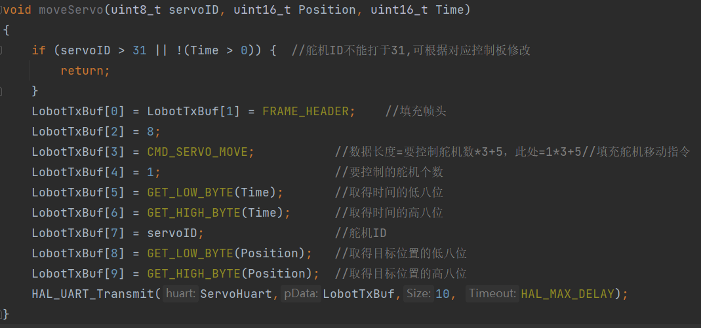
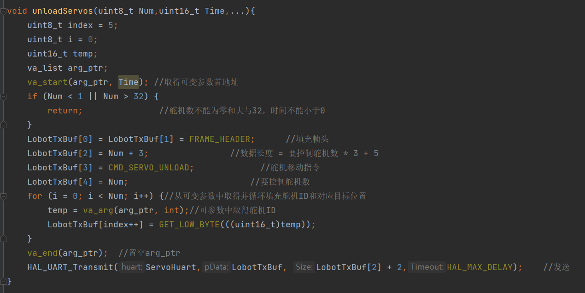
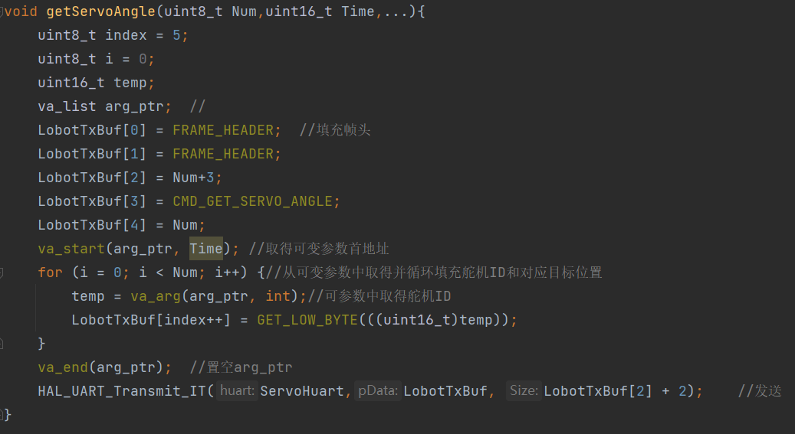

# Hexapod-代码细节说明

---

## 关于单片机

### main结构(main.c/main.h):

```c
//每次上电/复位重启，单片机都从main开始执行
int main(void)
{
//首先将一堆乱七八糟的东西（中断，优先级等）初始化
  while (1){
	//然后开始进入用户自定义代码段，位于死循环内
  }
}

```

### 中断(stm32f1xx_it.c/stm32f1xx_it.h)：

中断，就是打断main程序，暂停，并处理中断信号后，再返回原来的程序.

在串口通信（中断接收信息）会使用到中断.

详见[串口通信电控教程](https://gitee.com/mcpocket/RoboWalker/blob/master/%E7%94%B5%E6%8E%A7%E5%85%A5%E9%97%A8%E6%95%99%E7%A8%8B/%E5%AE%9E%E9%AA%8C%E6%95%99%E7%A8%8B/%E7%AC%AC%E4%B8%89%E6%AC%A1%E5%AE%9E%E9%AA%8C-%E4%B8%B2%E5%8F%A3%E9%80%9A%E4%BF%A1.md#%E7%A9%BA%E9%97%B2%E4%B8%AD%E6%96%AD%E6%8E%A5%E6%94%B6)

实例代码中采用空闲接收中断.

```c
void USART2_IRQHandler(void)//当串口2触发中断时调用
{
	//接收数据处理
}

void HAL_UART_RxCpltCallback(UART_HandleTypeDef *huart)//中断回调函数
{
    //回调处理
}
```

## 关于Servo底层函数的实现(Servo.h/Servo.c/ServoDeviation.h)

舵机主要通过向指定串口发送特定格式的命令实现各种操作,命令格式详见[**舵机开发说明书**](../Manual/ServoManual.pdf).

主要函数：

### moveServo():针对指定的舵机ID,将其旋转至指定位置(0-2000),运动时间为Time(数值越小越快，反之越慢,速度有上限)

### moveServos():移动多个舵机，原理同上

多组moveServos就可以构成一个动作组

```c
用例:
moveServos(3, 1000,
           11, 200,
           12, 333,
           14, 555)//1000ms内移动3个舵机，11号舵机移动到200位置，12号舵机移动到333位置，14号舵机移动到555位置
```



### unloadServos():将多个舵机断电(松开)



### getServoAngle():获取指定舵机的当前角度(0-2000)(发送后舵机会返回相关信息)



### 一些细节

- 通过串口向舵机发送命令有阻塞式和非阻塞式两种，前者在发送命令完成前CPU会被卡在当前任务进程直至发送完成，后者会触发中断后交由相关硬件处理发送，而后CPU马上继续向下执行。由于完成一个动作需要同时控制多个舵机，且动作执行较为连续，又考虑到中断等相关问题，在短时间内连续多次非阻塞式串口发送会导致部分信息无法被正确发送,故均采取阻塞式通信.

- 考虑到安装机器人时舵盘与外壳安装位置的偏差等因素，需要将舵机转角命令数据经过特定调校才能转化为相对偏转角度。

  （例如某舵机在输入转动位置为540时关节与地面平行，输入900时关节与地面垂直，可知舵机角度为600时，关节转角为90*(（600-540）/ (900-540) )= 15°,这些数据只能用调试程序一点点调整测试得出.......存储在ServoDeviation.h中，MIN代表0°位置，MAX代表90°位置）

